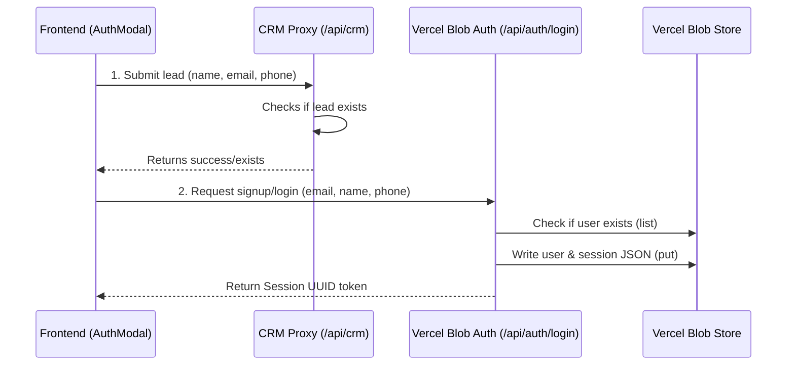

# Vercel Blob Storage Auth & CRM Integration Guide

This guide explains how the authentication system works, how it connects to Vercel Blob Storage and the CRM, the issues encountered during setup, and how they were solved.

---

## 1. Authentication Architecture

The application uses a two-step signup flow:



### Sign-Up Flow
1. **Submit to CRM**: The client registers the user details by hitting `/api/crm`. The CRM handler proxies this request to the lead management API.
2. **Initialize Session**: Upon CRM success, the client triggers `/api/auth/login` with `action: "signup"`.
3. **Verify and Write User**: The serverless function checks if a file exists at `users/${email}.json` in Vercel Blob. If not, it writes a new JSON file containing the user's name, email, phone, and creation date.
4. **Create Session**: The handler generates a unique UUID session token, records the token and expiration details in `sessions/${sessionToken}.json` in Vercel Blob, and returns it to the client, which stores it in `localStorage`.

### Sign-In Flow
1. **Login Request**: The client requests `/api/auth/login` with `action: "login"`.
2. **Verify User**: The handler lists files with prefix `users/${email}.json`. If the file does not exist, it rejects the login, instructing the user to sign up.
3. **Issue Session**: If the user exists, a new session is recorded in Vercel Blob (`sessions/${sessionToken}.json`), and the token is returned to the browser.

---

## 2. Issues Encountered & Solutions

### A. Vercel Blob: Public / Private Mismatch
* **Symptom**: 
  ```
  Blob auth error: BlobError: Vercel Blob: Cannot use public access on a private store. The store is configured with private access.
  ```
* **Cause**: The Vercel Blob store (`nova-ledger-blob`) was configured as a **Private** store. The backend code was calling `put()` with `{ access: "public" }`. Vercel rejected the upload because a private store cannot generate public URLs.
* **Solution**: Updated the access settings in [api/auth/login.ts](file:///c:/My%20Drive/Freelance/Projects/AUTODIGIX/Golden%20Black%20(20)/api/auth/login.ts) to:
  ```typescript
  {
    access: "private",
    token: BLOB_TOKEN,
    ...
  }
  ```

### B. Outdated SDK Restricting Private Parameter
* **Symptom**:
  ```
  Blob auth error: BlobError: Vercel Blob: access must be "public"
  ```
* **Cause**: The project was using `@vercel/blob` version `^0.27.0`. The SDK version had a client-side/SDK check validation hardcoded to throw an error if the `access` parameter was not explicitly set to `"public"`.
* **Solution**: Upgraded the package to the latest version, which supports the `"private"` access parameter matching your store:
  ```bash
  npm install @vercel/blob@latest
  ```

### C. CRM "Account already exist" 500 Response
* **Symptom**:
  ```
  CRM error: 500 {"error":"Failed to create account: Account already exist!"}
  ```
* **Cause**: The CRM server returned a `500` status because the email was already registered.
* **Solution**: The backend CRM proxy code in [api/crm.ts](file:///c:/My%20Drive/Freelance/Projects/AUTODIGIX/Golden%20Black%20(20)/api/crm.ts) correctly catches this error, inspects the payload, and translates it into a `200 OK` response with `{ success: true, message: "Account already exists" }` so that the user is immediately logged in via Vercel Blob instead of failing the sign-up flow.
